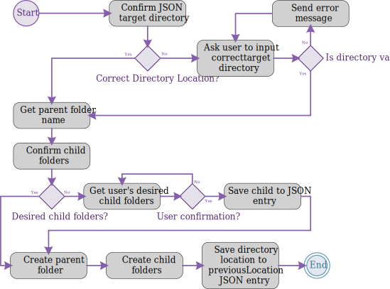

# python-file-maker
## About Project
This project is the documentation for a python program that will create a desired template file structure for my college classes. I found myself wanting a solution that doesn't involve me manually typing the same generic file folder names over and over, because 1. it's time consuming, and 2. gives me the opportunity to try my hand at some newly learned techniques that hopefully will help me create and write better code along with better and more complete documentation. One of the early example will be an activity diagram that I will upload as the first item to this github repo, well besides all the other general boiler plate stuff such as the README and the LICENSE to go along with it. Nonetheless, this is my project, hopefully you too can learn something.
## Activity Diagram

  

This diagram describes in essence the steps the program goes through to achieve the desired result. So, first the program checks the previously used target directory location from the JSON file and ask the user if they want to use that same location, if the user declines to use the same location the program queries the user for the desired location, upon the user submitting the location to the program, the program checks the location to make sure the location is a valid location, if this check returns false then the program returns an error message and goes back and queries the user for a location after which is continues the same process until a valid location is given or the user exits the program. Now if the valid location check returns true, then the program continues to the next step. In the next step, the program queries the user for a name of the parent folder, the parent folder is the folder that will contain all the other child foldewrs within it, in the ideal scenario, the name of the parent folder would be the current college class abbreviation followed by the course ID. After the user submits the parent folder name, the program will check and see if the user would like to use the same folder names for the child folders that were used in the last program session. If the user returns a false reply, the program then queries the user for the desired child folder names. Once the user has supplied the program with all the desired child folder names, the program will ask the user to confirm that all the names given are correct, if the user confirmation returns false, then the user will be queried for the names of the child folders all over again. This process will continue until the user confirms the child folder names are correct or the user terminates the program. Once the user confirms the child folder names, the program saves the child folder names into the JSON configuration file and goes on to the next step. In the next step the program creates the parent folder with the supplied parent folder name, then creates the child folders with the supplied child folder names. Once these actions have been completed the program then saves the directory location into the previousLocation entry in the JSON file. Then the program is ended and exited.
